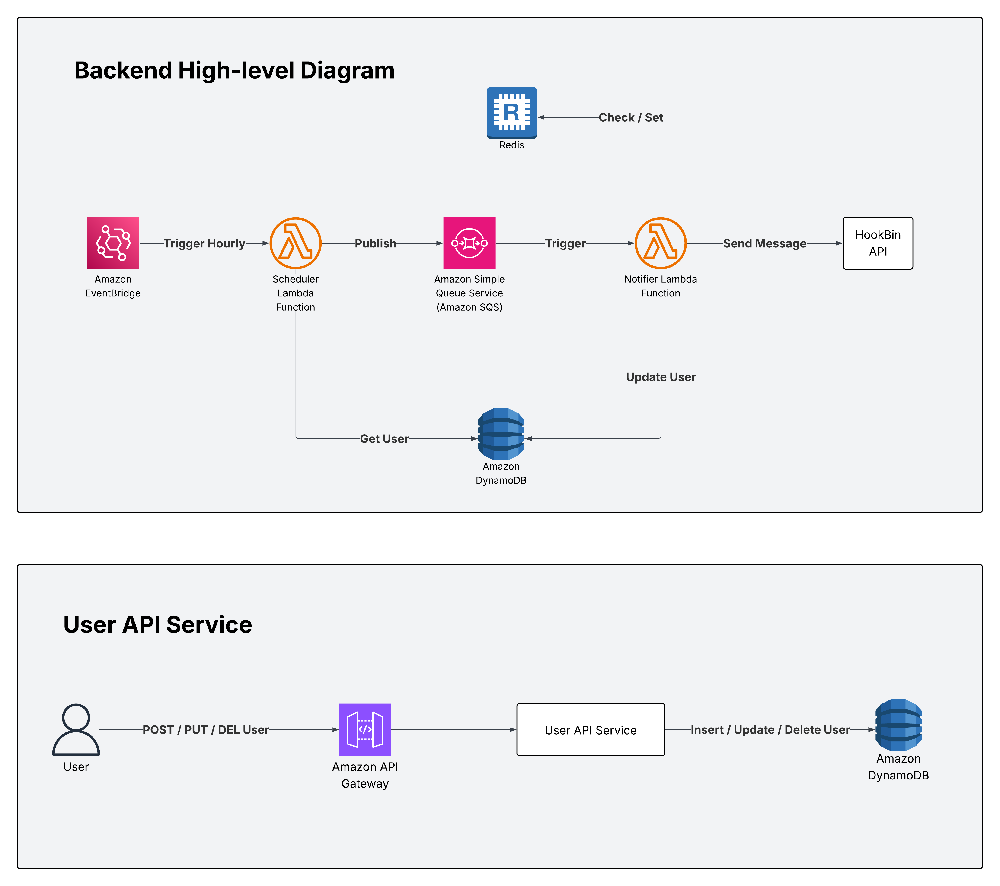

# Birthday Message Notification System

A scalable, serverless birthday notification system built with TypeScript, AWS Lambda, DynamoDB, Redis, and SQS. The system sends birthday greetings to users at exactly 9:00 AM in their local timezone.

## Architecture



This system uses a **microservices architecture** with three main services:

1. **User API Service**: REST API for managing users (Create, Update, Delete)
2. **Scheduler Service**: Hourly cron job that identifies users whose birthday is today
3. **Notifier Service**: SQS consumer that sends birthday messages and handles deduplication

### Tech Stack

- **Language**: TypeScript (Node.js)
- **Database**: DynamoDB (On-Demand capacity)
- **Cache**: Redis (for message deduplication)
- **Queue**: AWS SQS (with Dead Letter Queue)
- **Compute**: AWS Lambda
- **Scheduling**: AWS EventBridge
- **Local Development**: LocalStack + Docker Compose

## Prerequisites

- Node.js 22+
- Docker & Docker Compose
- LocalStack
- AWS CLI Local (LocalStack)

## Setup

### 1. Install Dependencies

```bash
# Install root dependencies
npm install
```

### 2. Start Infrastructure

```bash
# Start LocalStack and Redis
docker-compose up -d

# Verify services are running
docker ps
```

### 3. Deploy Services Locally

```bash
# Deploy all serverless
npm run deploy
```

### 4. Remove Deployed Services

```bash
# Remove all serverless
npm run remove
``` 

### 5. Stop Infrastructure

```bash
# Stop LocalStack and Redis
docker-compose down
```

## API Documentation

Once the User API Service is deployed, Endpoint is available at:

**LocalStack**: `http://localhost:4566/restapis/{API_ID}/local/_user_request_/user`

### Endpoints

#### Create User
```bash
POST /user
{
  "firstName": "John",
  "lastName": "Doe",
  "birthday": "1990-01-15",
  "city": "Manila",
  "state": "",
  "country": "Philippines"
}
```

#### Update User
```bash
PUT /user
{
  "userId": "uuid-here",
  "firstName": "Jane",
  "lastName": "Doe",
  "birthday": "1990-01-15",
  "city": "Manila",
  "state": "",
  "country": "Philippines"
}
```

#### Delete User
```bash
DELETE /user/{userId}
```

## Testing

### Manual Testing

1. **Create a test user** with a birthday in the past (to trigger immediately):

```bash
curl -X POST http://localhost:4566/restapis/{API_ID}/local/_user_request_/user \
  -H "Content-Type: application/json" \
  -d '{
    "firstName": "Test",
    "lastName": "User",
    "birthday": "1990-12-03",
    "city": "Manila",
    "state": "",
    "country": "Philippines"
  }'
```

2. **Manually invoke the scheduler**:

```bash
serverless invoke local --function scheduler --stage local
```

3. **Check SQS** for messages:

```bash
awslocal --endpoint-url=http://localhost:4566 sqs receive-message \
  --queue-url http://localhost:4566/000000000000/birthday-notification-queue-local
```

4. **Check Redis** for deduplication:

```bash
docker exec -it $(docker ps -q -f name=redis) redis-cli
> KEYS sent:*
```

## Configuration

### Environment Variables

**User API Service** (`user-api-service/serverless.yml`):
- `DYNAMODB_TABLE`: DynamoDB table name
- `REDIS_HOST`: Redis hostname
- `REDIS_PORT`: Redis port

**Scheduler** (`scheduler/serverless.yml`):
- `DYNAMODB_TABLE`: DynamoDB table name
- `SQS_NOTIFIER_QUEUE_NAME`: SQS queue name

**Notifier** (`notifier/serverless.yml`):
- `DYNAMODB_TABLE`: DynamoDB table name
- `REDIS_HOST`: Redis hostname
- `REDIS_PORT`: Redis port
- `SQS_NOTIFIER_QUEUE_NAME`: SQS queue name
- `PIPEDREAM_WEBHOOK_URL`: Webhook endpoint (update with your Pipedream URL)

### Update Pipedream Webhook URL

Before testing, create your own Pipedream at [https://pipedream.com](https://pipedream.com) and update:

```yaml
# notifier/serverless.yml
provider:
  environment:
    PIPEDREAM_WEBHOOK_URL: https://hookbin.com/YOUR_BIN_ID
```

## Author

Jeff Robert Dagala
[GitHub](https://github.com/jrdagala) - [LinkedIn](https://linkedin.com/in/jrdagala) - [Email](mailto:jrdagala@gmail.com)
